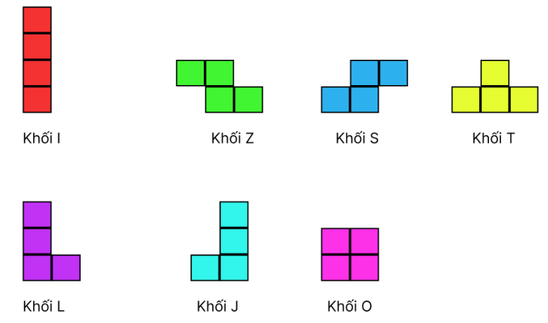

# Tetris
## Về
Tetris là một trò chơi điện tử xếp hình kinh điển, ra đời vào năm 1984, nổi bật với lối chơi đơn giản nhưng vô cùng cuốn hút. Trong trò chơi này, người chơi sẽ điều khiển các khối hình gọi là Tetriminos (được tạo thành từ bốn ô vuông nối liền nhau) rơi xuống một lưới chữ nhật (Matrix). Nhiệm vụ của người chơi là sắp xếp các khối hình sao cho chúng lấp đầy một hàng ngang, khiến hàng đó biến mất và ghi điểm.

## Tính năng chính
- Các thao tác điều khiển bao gồm:
### Xoay khối: 
Người chơi có thể xoay Tetrimino 90 độ theo chiều kim đồng hồ mỗi lần bấm phím (thường là phím mũi tên lên hoặc phím xoay cụ thể). Khối sẽ xoay quanh một trục cố định gọi là điểm xoay (rotation point).
### Di chuyển khối:
- Trái và phải: Người chơi sử dụng phím mũi tên trái hoặc phải để di chuyển Tetrimino sang hai bên trong lưới.
Khi di chuyển, trò chơi sẽ kiểm tra va chạm để đảm bảo khối không vượt ra ngoài phạm vi lưới hoặc chồng lên các khối khác đã đóng băng.
Hạ nhanh khối (Soft Drop và Hard Drop):
+ Soft Drop: Nhấn giữ phím mũi tên xuống để tăng tốc độ rơi của khối Tetrimino.
+ Hard Drop: Nhấn phím đặc biệt để đưa Tetrimino xuống vị trí thấp nhất có thể ngay lập tức. Điều này giúp tiết kiệm thời gian và gia tăng tốc độ trò chơi.
### Đóng băng khối (deadBlocks):
Khi Tetrimino không thể rơi thêm nữa (chạm đáy hoặc va chạm với khối khác), nó sẽ "đóng băng" tại vị trí hiện tại.
Một khối đóng băng không thể xoay hoặc di chuyển thêm.
### Mục tiêu các chế độ chơi:
+ Vô hạn: Xếp các khối sao cho lấp đầy hàng ngang để hàng đó bị xóa và ghi điểm.
+ Màn chơi: Xếp các khối sao cho các gemblocks được ăn. Tổng cộng có 10 màn nếu thắng trò chơi thông báo “Hoàn Thành”.

### Nhạc nền và hiệu ứng âm thanh
- Triển khai BGM cổ điển cũng như hiệu ứng âm thanh cho phiên bản arcade Tetris.
